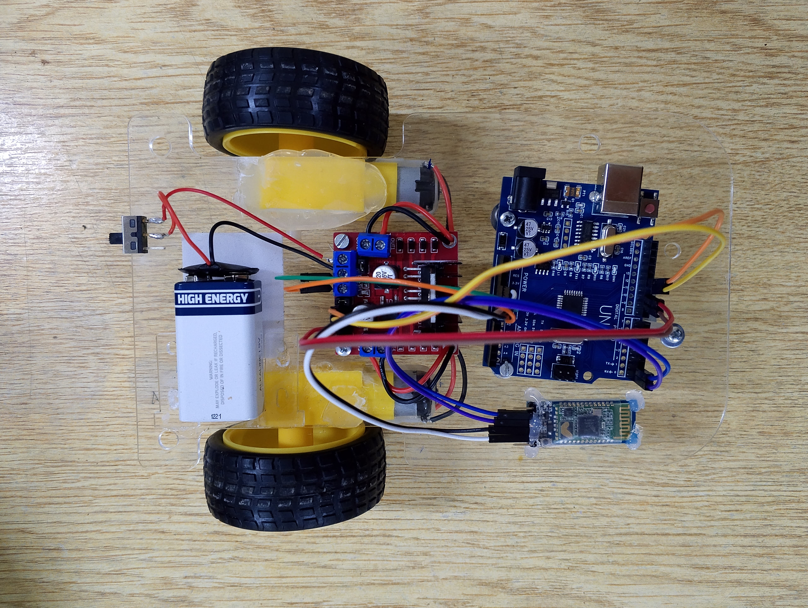
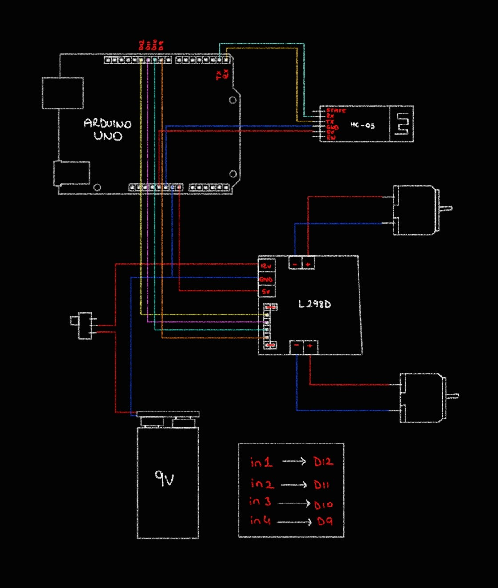

## 🚗 `Arduino 2wd Bluetooth Car`

 

<h3> </h3>

<h3>⚡Pinout </h3>

 

- ✅ Arduino 2wd Bluetooth Car

 

Used Technologies in The Project:

 

 

# License

This project is licensed under the MIT License. See the [LICENSE](LICENSE) file for details
